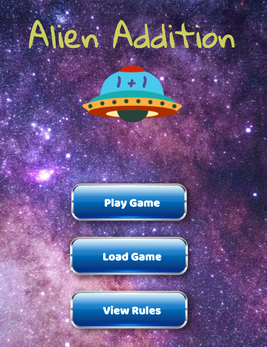
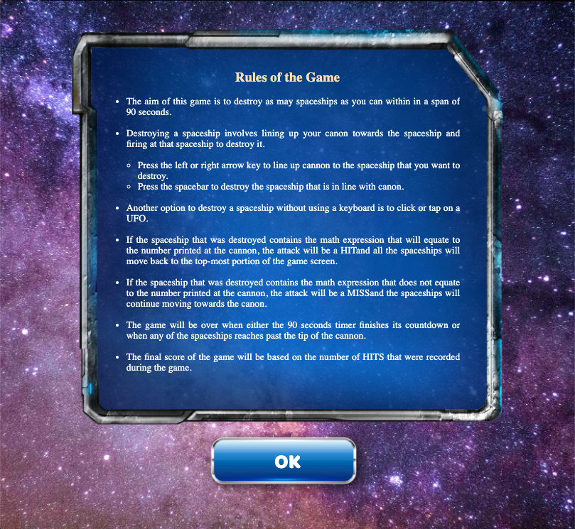
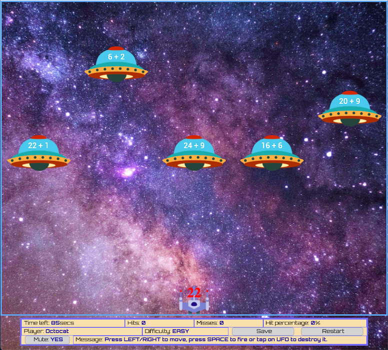

# Alien-Invasion-Math-Game

MADS4007 Project - An Educational Alien Shooter Web App for Kids.    
(App can be played online using this link: https://alienaddition.louisechan.ca/)

          

PROBLEM DESCRIPTION

You have been asked to develop an educational Alien Invasion math game in the form of a
web application. The intent of this game is to test players mathematical acuity on basic
arithmetic, specifically addition.
A well-designed responsive web interface, similar to the ones presented below must be
developed to allow the player to play the game. Please note, this game must look and
function well on desktop web browsers, specifically Google Chrome.
Rules:
● When the player launches the game, he/she, via buttons, should be allowed to start
the game and view the rules of the game. Also, at start up, via some sort of audio
icon, the game should give the player the ability to turn off or turn on audio for the
game.
● The player should then be allowed to enter their name and then select a difficulty
level, i.e, easy or hard.
Figure 1.1
Figure 1.2
● When the game commences, it should mirror Figure 1.3 - Figure 1.5, invading
spaceships with math problems moving (slowly or fast, this depends on the difficulty
level) down from the top of the screen toward a laser cannon on a platform at the
bottom. Answers are placed “on” the cannon to “destroy” the invader with the correct
answer. Note, each spaceship MUST move at slightly different speeds.
Figure 1.3
Figure 1.4
Figure 1.5
● The aim of the game is to use the cannon to “shoot down” or destroy as many
invading spaceships with correct answers, during a particular time frame. This must
be done without any of the invading spaceships touching the cannon and/or the
plank the cannon is on.
● You must use the left and the right arrow key to move the cannon. Once the cannon
is moved or positioned underneath a spaceship then you must use the spacebar key
to fire at the spaceship.
● Every time the cannon destroys a correct answer invading spaceship, all the
spaceship goes back to the top, new math problems are generated on all
spaceships and a new answer is placed on the cannon.
● If the cannon shoots at an incorrect answer invading spaceship, new math problems
are generated on all spaceships and a new answer is placed on the cannon.
However, the spaceships continue to proceed to touch the cannon and/or plank as at
their current position. Under this circumstance, the spaceships do not go back to the
top as compared to destroying a correct answer spaceship.
● Please note, at all times, 5 invading spaceships must be present and at any given
time, there must only be one correct answer invading spaceship that corresponds to
the answer on the cannon.
● Your number of “hits” is increased every time an invading spaceship with the correct
answer is destroyed . Whereas, every time an invading spaceship with an incorrect
answer is destroyed it will be recorded as a “miss”.
● The player will automatically lose the game if the cannon or plank is touched
by an invading spaceship.
● Ensure that you have a save button on the game screen. When the user hits the
save button, your game must save all the user's data, i.e, player's name, difficulty
level current level, current question and its corresponding spaceship choices, number
of hits, number misses, and current time Remaining. If a user decides
Addition Rules
As mentioned earlier, the intention of this game is to test the player’s ability to add
basic numbers within 90 seconds .
For each math problem/“Invading spaceship”, two random numbers must be
generated. The first random generated number must be between 1 to 25 and the
second random generated number must be between 1 to 9. The correct answer,
which will be written on the cannon, must also be randomly generated.
Once the cannon is not touched and when the 90 seconds is up, the player will win
the game and the player will be presented with a report detailing the following
information :
1. Player’s name.
2. Difficulty Level
3. The number of hits the player got for each level. The hits are the questions
that the player answered correctly.
4. The number of misses the player had for each level. The misses are the
number of questions that the player answered incorrectly.
